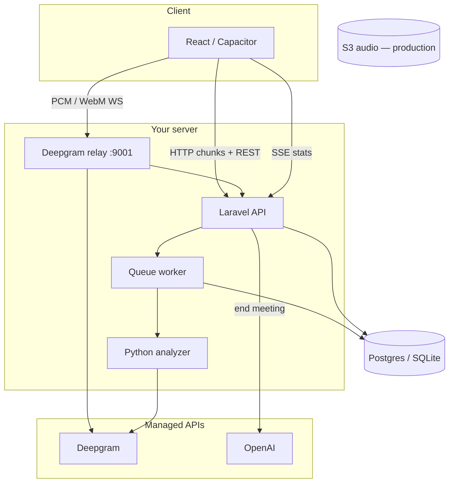

# WeChirp technology stack

Official stack for the Otter-style meeting product. **Deepgram** is the only STT provider; everything else is chosen for production quality, solo-team velocity, and clear upgrade paths.

## Stack at a glance

| Layer | Technology | Role |
|--------|------------|------|
| **Live STT** | [Deepgram](https://deepgram.com) Nova-3 (live), Nova-2 (batch) | Streaming transcript + diarization |
| **Live ingest** | PHP Amp WebSocket relay (`php artisan deepgram:relay`) | Auth, forward audio, voiceprint matching |
| **Batch / chunks** | Laravel queues + `scripts/analyze_audio.py` | HTTP fallback, analytics, crosstalk |
| **Speaker ID** | SpeechBrain ECAPA (`scripts/embed_audio.py`) | Enroll + match voiceprints |
| **Post-meeting AI** | OpenAI `gpt-4o-mini` + `text-embedding-3-small` | Summary, topics, actions, semantic search |
| **API & jobs** | Laravel 13 + Sanctum | REST, admin, background work |
| **Client** | React 19 + Vite + Capacitor | `/app` consumer UI, iOS/Android shells |
| **Realtime UI** | WebSocket (audio up) + SSE (stats/transcript poll) | Live studio experience |

Configuration lives in [`config/wechirp.php`](../config/wechirp.php).

## Data flow



## Why these choices

### Deepgram (required)
- Sub-300ms partials for live captions
- Built-in diarization (`speaker_0`, `speaker_1`)
- Same vendor for live relay and batch `analyze_audio.py` — one API key, one mental model

### Laravel + PHP relay (keep)
- You already have a full relay with voiceprint matching and DB writes
- Replacing with Node is optional at scale; not required for MVP

### OpenAI (not LangChain)
- Structured JSON summaries via `WechirpAiService`
- Embeddings for cross-meeting search without orchestration bloat
- Keys: `OPENAI_API_KEY`, models in `.env`

### SpeechBrain voiceprints (keep)
- Differentiator vs generic STT: map diarization labels to enrolled names
- Run `bash scripts/setup-voiceprint.sh` once per machine

### React + Capacitor (keep)
- One UI for web and native WebView
- **Real device** for mic testing; Simulator uses Mac input (see `scripts/simulator-voice-intro-setup.sh`)

## Production checklist

Full deploy guide: [`wechirp-production.md`](wechirp-production.md) · env template: [`.env.production.example`](../.env.production.example)

| Concern | Dev (default) | Production target |
|---------|---------------|-------------------|
| Database | SQLite | **PostgreSQL** (+ optional pgvector later) |
| Queue | `database` | **Redis** (`scripts/production-queue-worker.sh`) |
| Audio chunks | `WECHIRP_AUDIO_DISK=meeting_audio` | **`WECHIRP_AUDIO_DISK=s3`** + AWS bucket |
| Relay temp | local disk | local disk (not S3) |
| Relay URL | `ws://127.0.0.1:9001` | **wss://** via nginx/Caddy + `WC_RELAY_WS_URL` |
| APP_URL | `http://127.0.0.1:9000` | HTTPS domain for Capacitor + Sanctum |

## Explicitly not in v1 stack

- **Pulse / Whisper / AssemblyAI** as primary STT — removed from product path; Deepgram only
- **LangChain** in hot path — direct HTTP to OpenAI
- **Meeting bots** (Recall.ai) — optional later for Zoom/Meet; pocket recorder is core UX

## Commands

```bash
composer run dev          # Laravel :9000, queue, Vite, relay :9001
npm run dev:ios           # Simulator deploy + servers
php artisan voiceprint:verify
bash scripts/setup-voiceprint.sh
```

## Health

`GET /api/meetings/services/health` (authenticated) reports STT, relay, OpenAI, voiceprint, and queue depth.
